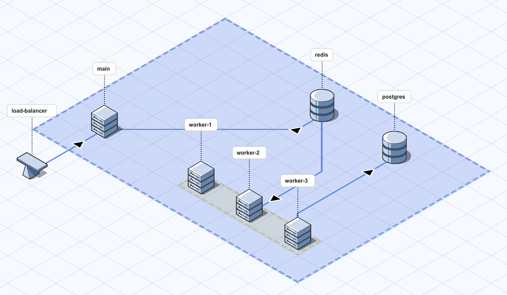

# Production Grade Horizontal n8n on DigitalOcean

Welcome to the documentation for deploying production grade horizontal n8n on DigitalOcean.

This Terraform configuration deploys a production-ready n8n setup with:

- ✅ **PostgreSQL database cluster** - Managed database for n8n data
- ✅ **Valkey (Redis) database cluster** - Queue backend for production grade horizontal n8n
- ✅ **Main droplet** - n8n coordinator/web UI
- ✅ **Worker droplets** - Scalable n8n workers for execution
- ✅ **VPC** - Secure private networking between resources

## Quick Navigation

- [Quick Start Guide](getting-started/quick-start.md) - Get up and running in minutes
- [Architecture Overview](architecture/overview.md) - Understand the infrastructure
- [Configuration](configuration/variables.md) - Customize your deployment
- [Troubleshooting](troubleshooting.md) - Common issues and solutions

## Features

### Production Grade Horizontal n8n

Scale your n8n workers independently based on workload. Add or remove worker droplets as needed.

### High Availability

- Managed database clusters with automatic backups
- Load balancer for the main instance
- Private networking for secure communication

### Docker Ready

All droplets use the `docker-20-04` marketplace image with Docker and Docker Compose pre-installed.

## Getting Started

1. Check the [Prerequisites](getting-started/prerequisites.md)
2. Follow the [Quick Start Guide](getting-started/quick-start.md)
3. Review the [Configuration](configuration/variables.md) options

---

For detailed information, see the sections in the navigation menu.

